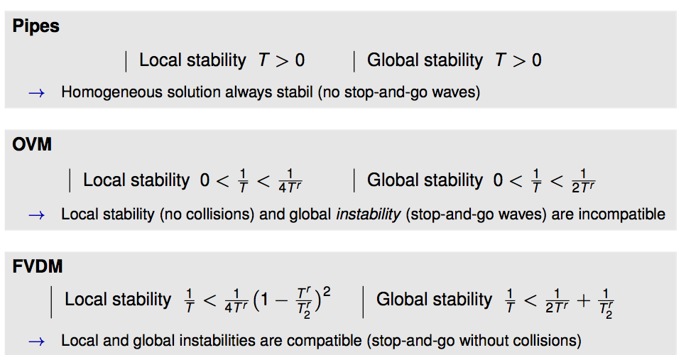

# Car-collowing models

Comparison of three car-following models with respect to their stability.

## Pipes (Louis A. Pipes 1953)

## Optimal-Velocity-Modell (OVM) (Masako Bando et al. 1995)

with a reaction time `T^r>0`.

## Full-Velocity-Difference-Modell (FVDM) (Rui Jiang et al. 2001)

with `T^r, T^r_2>0` two relaxation constants.

## Local and global stability

## Usage

- Download [NetLogo](https://ccl.northwestern.edu/netlogo/download.shtml) and open the nlogo-file.
- Adapt the number of agents `Nb-peds` and click on `Setup`
- `Move` to start the simulation

You can change the parameters while the simulation is running. However, when the number of agents is changes, you need to `Setup` again.

## Credits

Antoine Tordeux (tordeux@uni-wuppertal.de)
