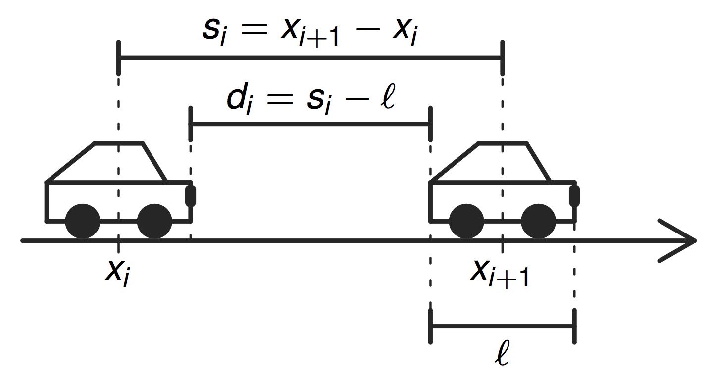

# Car-collowing models

Comparison of three car-following models with respect to their stability.

## Pipes (Louis A. Pipes 1953)

$$
\dot x_i(t)=\frac{d_i(t)}{T}=\frac{x_{i+1}(t)-x_i(t)-\ell}{T}\quad T > 0.
$$

## Optimal-Velocity-Modell (OVM) (Masako Bando et al. 1995)

$$
\ddot x_i(t)=\frac1{T^r}\Big(V\big(x_{i+1}(t)-x_i(t)\big)-\dot x_i(t)\Big),
$$

with a reaction time $T^t$.

## Full-Velocity-Difference-Modell (FVDM) (Rui Jiang et al. 2001)

$$
\ddot x_i(t)=\frac1{T^r}\big(V(x_{i+1}(t)-x_i(t))-\dot x_i(t)\big) + \frac1{T^r_2}\big(\dot x_{i+1}(t)-\dot x_i(t)\big),
$$
with $T^r,T^r_2>0$ two relaxation constants.

## Local and global stability

 |              | local                                                |   global                            |
|---------------|------------------------------------------------------|--------------------------------------
| Pipes        | $T > 0$                                              |  $T > 0$                            |
| OVM          | $\ 0<\frac1T<\frac1{4T^r}                            | 0<\frac1T<\frac1{2T^r}$             |
|FVDM          |$\frac1T<\frac1{4T^r}\big(1+\frac{T^r}{T^r_2}\big)^2$ | $\frac1T<\frac1{2T^r}+\frac1{T^r_2}$|

## Credits

Antoine Tordeux (tordeux@uni-wuppertal.de)
